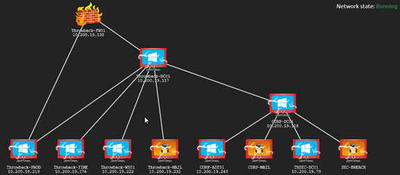

The Throwback network on [Tryhackme](https://tryhackme.com/room/throwback) simulate a realistic corporate Active Directory environment.The scenario of the CTF is a red team penetration testing assignment, of which you are a member. Since this network is segmented I will show how to pivot from the DMZ to the first domain.


## The lay of the land
At first you only some of the machine and they are added to the network diagram as you discovered them. I'll show you what the entire network looks like instead:

\
Figure 1: The Throwback network diagram


So let's begin by running nmap:

`nmap -sV -sC -p- -v 10.200.19.0/24 --min-rate 5000 -oN firstScan`

Notice the flag that are used and man them if they are not familiar. Looking at the truncated output, you can see:

````
Nmap scan report for 10.200.19.138
Host is up, received syn-ack (0.11s latency).
Scanned at 2021-03-11 18:57:58 EST for 359s
Not shown: 65531 filtered ports
Reason: 65531 no-responses
PORT    STATE SERVICE  REASON  VERSION
22/tcp  open  ssh      syn-ack OpenSSH 7.5 (protocol 2.0)
| ssh-hostkey: 
|   4096 38:04:a0:a1:d0:e6:ab:d9:7d:c0:da:f3:66:bf:77:15 (RSA)
|_ssh-rsa AAAAB3NzaC1yc2EAAAADAQABAAACAQDN6yAJkDf3ePS4Etb1KKfEe6Az22BPADTvyCijKGexA0/xVVqwbhlLdXRf8lsGIyxOrEA/VZx7yq+iYL+tW8fnItuLaco6YTDJbtK8V0FQCFTyfCINNKH/jYABwG1i6TkZnaneAXKby8snChez7+r1Bz1fPzxne4PTrvBazH58jHV5A3y+xgskcZct8LnGnaib4LoAtXgd+t1sVjv+BHbpevCbSHNxhqb4S/Vsja2XTr37U1SXnst6xRTqRHal1ziq08Ijzxm17I5bUY6wRZRv01IZCWdE9JHaoVbkHtMOPMAsOsg99fXnb8I++jruuFWJbNQ26/1rwMqeaIslpAsKsFijCe5IbXwvKuzI6A9sM0IYObV+CevgYraQ7G4zx+WeBUIqu8dOt16n4suz33kaI17jbBdfSR6GxdT3ysqEsSkLd6p0HIR0JxIk5t7qGhG9KSvfsk42JUMyoocbK3tO8O/xInXPSuBWiohcGz0aJckVIOJuQSm8dkGRj62yOfzSyh9utWWu8Zi/dngRR6qOCMz538aQ/DReNEgqXl0Zn2roj42scFhidj4VgO0vhClotAmOZrFhu3wXc91ImkTdvApK7XcAQ4NGIt8kf0TylvHkV8T39zOB2uoFgITShRqHUQ6AnxwivFkdbdALT2IWh3CJRVD4Vwwog5L4ohsDjw==
53/tcp  open  domain   syn-ack (generic dns response: REFUSED)
80/tcp  open  http     syn-ack nginx
| http-methods: 
|_  Supported Methods: GET HEAD POST OPTIONS
|_http-title: Did not follow redirect to https://10.200.19.138/
443/tcp open  ssl/http syn-ack nginx
|_http-favicon: Unknown favicon MD5: 5567E9CE23E5549E0FCD7195F3882816
| http-methods: 
|_  Supported Methods: GET HEAD POST
|_http-title: pfSense - Login
1 service unrecognized despite returning data. If you know the service/version, please submit the following fingerprint at https://nmap.org/cgi-bin/submit.cgi?new-service :
SF-Port53-TCP:V=7.91%I=7%D=3/11%Time=604AAEE9%P=x86_64-pc-linux-gnu%r(DNSV
SF:ersionBindReqTCP,E,"\0\x0c\0\x06\x81\x05\0\0\0\0\0\0\0\0");
````

